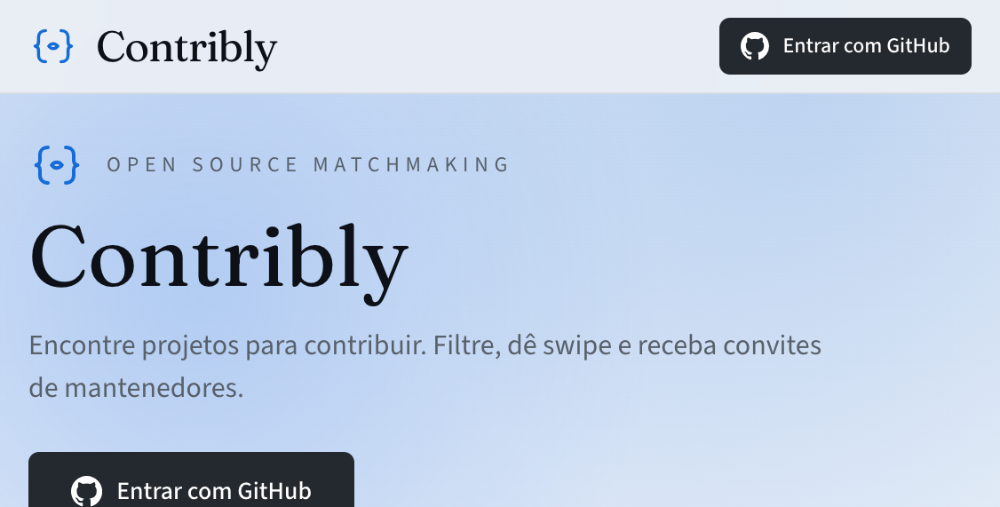
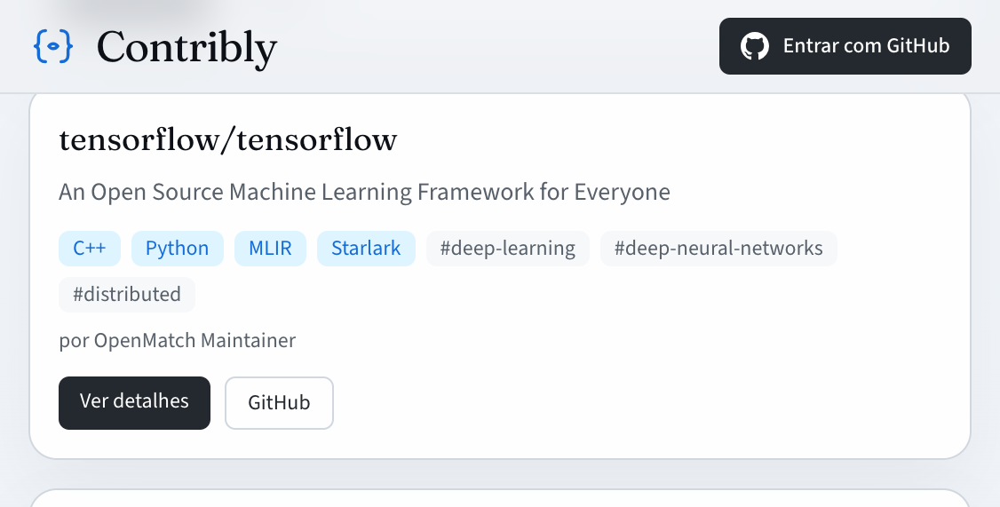
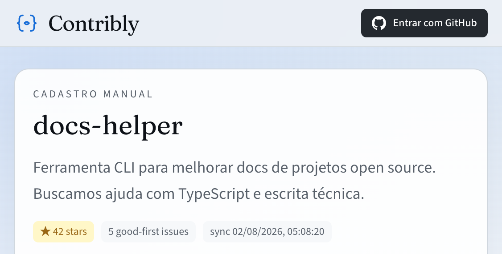
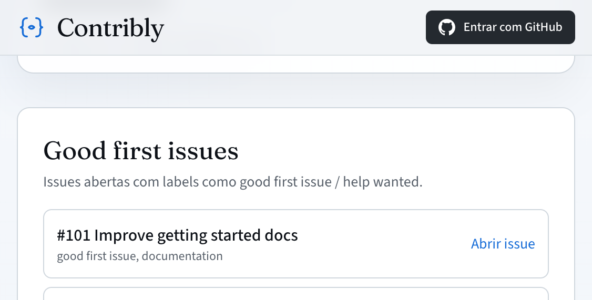

# Contribly

<p align="center">
  <strong>Open source matchmaking</strong> — conecte contribuidores a projetos que precisam de ajuda.
</p>

<p align="center">
  <a href="https://contribly.vercel.app">Live</a>
  ·
  <a href="#setup-local">Setup</a>
  ·
  <a href="#funcionalidades">Features</a>
  ·
  <a href="docs/PRODUCTION_CHECKLIST.md">Deploy</a>
  ·
  <a href="CONTRIBUTING.md">Contribuir</a>
</p>

---



**Contribly** é uma plataforma web para descobrir repositórios open source, demonstrar interesse (swipe), e combinar o próximo passo com mantenedores — aceite, convite e conversa na thread do match.

> App em produção: [https://contribly.vercel.app](https://contribly.vercel.app)  
> Repo GitHub (nome legado): [cauesilva1/openmatch](https://github.com/cauesilva1/openmatch)

---

## Por que existe

Contribuir em open source ainda é difícil: achar um first issue bom, saber se o projeto quer ajuda, e falar com o mantenedor. O Contribly encurta esse caminho:

1. **Login com GitHub** — perfil e linguagens sincronizados dos seus repos  
2. **Descobrir / Pra você / Swipe** — filtre ou use o deck de interesse  
3. **Match** — mantenedor aceita, convida, e a conversa segue no app  

---

## Screenshots

### Landing

Hero com login GitHub e proposta de valor.


### Destaques na home

Cards de projetos recentes com linguagens e tags.



### Detalhe do projeto

Stars, sync de issues e CTA para swipe.



### Good first issues

Issues abertas com labels *good first issue* / *help wanted*, link direto no GitHub.



---

## Funcionalidades

### Contribuidores

| Área | O que faz |
|------|-----------|
| **Perfil** | Bio, linguagens/skills (autocomplete), aberto a convites, sync GitHub |
| **Onboarding** | Completa o perfil após o primeiro login |
| **Discover** | Busca e filtros por linguagem / tags |
| **Pra você** | Ranking por matching (skills, labels, histórico, stars, frescor) |
| **Swipe** | Interesse / passar — gesto de arrastar + botões |
| **Inbox** | Interesses, convites e notificações in-app |
| **Match thread** | Mensagens no contexto do projeto aceito |

### Mantenedores

| Área | O que faz |
|------|-----------|
| **Publicar** | Cadastro manual ou import por URL do GitHub |
| **Sync** | Stars + issues *good first* / *help wanted* ao publicar e via cron |
| **Dashboard** | Analytics (taxa de aceite, stars) e candidatos sugeridos |
| **Aceitar / convidar** | Fluxo de interesse → aceite → convite |

### Plataforma

- Auth.js + GitHub OAuth  
- Sitemap dinâmico de projetos + `robots.txt`  
- Cron diário (`0 12 * * *`) em `/api/cron/sync-issues` (protegido por `CRON_SECRET`)  
- Exclusão de conta (LGPD)  
- CI (typecheck, testes, lint, build)  

---

## Stack

| Camada | Tecnologia |
|--------|------------|
| App | Next.js 15 (App Router) + React 19 |
| Auth | Auth.js (`next-auth` v5) + GitHub OAuth |
| Dados | Prisma 6 + PostgreSQL (Supabase) |
| UI | Tailwind CSS 4, Radix Slot, Lucide, Sonner |
| Deploy | Vercel |
| Testes | Vitest |

---

## Setup local

### Pré-requisitos

- Node.js 20+  
- Conta [Supabase](https://supabase.com) (Postgres)  
- [GitHub OAuth App](https://github.com/settings/developers)  

### 1. Clone e instale

```bash
git clone https://github.com/cauesilva1/openmatch.git
cd openmatch
npm install
```

### 2. Ambiente

```bash
cp .env.example .env
```

Preencha no `.env`:

| Variável | Uso |
|----------|-----|
| `DATABASE_URL` | Pooler Supabase (porta **6543**, `?pgbouncer=true`) |
| `DIRECT_URL` | Conexão direta (porta **5432**) — migrations |
| `AUTH_SECRET` | `openssl rand -base64 32` |
| `AUTH_GITHUB_ID` / `AUTH_GITHUB_SECRET` | OAuth App |
| `AUTH_URL` | Só em produção: `https://contribly.vercel.app` |
| `GITHUB_TOKEN` | Opcional — rate limit maior no sync |
| `CRON_SECRET` | Opcional local; **obrigatório** em prod para o cron |

**Callback OAuth local:**  
`http://localhost:3000/api/auth/callback/github`

**Callback OAuth produção:**  
`https://contribly.vercel.app/api/auth/callback/github`

### 3. Banco

```bash
npx prisma migrate dev
# opcional — dados demo:
npm run db:seed
```

### 4. Rodar

```bash
npm run dev
```

Abra [http://localhost:3000](http://localhost:3000).

---

## Scripts

| Comando | Descrição |
|---------|-----------|
| `npm run dev` | Dev server (Turbopack) |
| `npm run build` / `npm start` | Build e servidor de produção |
| `npm run lint` | ESLint |
| `npm run typecheck` | TypeScript sem emitir |
| `npm test` | Vitest (uma vez) |
| `npm run ci` | typecheck + test + lint + build |
| `npm run db:migrate` | `prisma migrate dev` |
| `npm run db:push` | `prisma db push` |
| `npm run db:seed` | Seed demo |
| `npm run db:studio` | Prisma Studio |

---

## Deploy (Vercel)

O app **já está publicado** em [contribly.vercel.app](https://contribly.vercel.app). Push em `main` dispara novo deploy automaticamente.

Checklist completo: [docs/PRODUCTION_CHECKLIST.md](docs/PRODUCTION_CHECKLIST.md).

Resumo:

1. Variáveis na Vercel iguais ao `.env.example` (com `AUTH_URL` e `CRON_SECRET`)  
2. OAuth App apontando para a URL de produção  
3. Migrations em prod: `npx prisma migrate deploy` (usando `DIRECT_URL`)  
4. Cron configurado em `vercel.json`  

Não é necessário republicar em outro lugar para o produto **funcionar**. Divulgação (Product Hunt, Reddit, Discord, topics no GitHub) é opcional e só aumenta descoberta.

---

## Estrutura do repositório

```
src/
  app/             # rotas App Router (páginas + API + actions)
  components/      # UI
  lib/             # matching, GitHub sync, validators, prisma
prisma/            # schema, migrations, seed
docs/              # checklist de produção + imagens do README
public/            # assets estáticos
.github/           # CI
```

---

## Matching (visão rápida)

O score em `src/lib/matching.ts` combina, entre outros:

- overlap de linguagens / skills  
- labels de issues (*good first issue*, *help wanted*, …)  
- histórico de swipes  
- stars do repositório  
- frescor do último sync de issues  

Candidatos no dashboard do mantenedor usam a mesma base para ranking.

---

## Contribuindo

Veja [CONTRIBUTING.md](CONTRIBUTING.md). PRs pequenos e focados no loop **discover → swipe → accept → GitHub**.

## License

[MIT](LICENSE)
